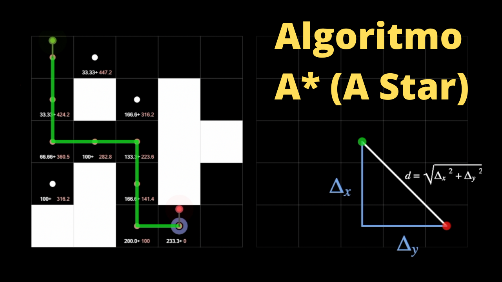

# Demonstração do funcionamento do Algoritmo A*

Esse projeto foi utilizado para criar as animações utilizadas nesse vídeo https://bit.ly/astar-al
<br/>Assista o vídeo para entender o funcionamento. 

<a href="https://bit.ly/astar-al" target="_blank">
  
</a>
<br/>
Fique a vontade para utilizar ou alterar o código!

### Screeshots


<br/><br/>


### Como executar

* Execute o **video/index.html**
* Para ver outras animações utilizadas no vídeo, retire o comentário da importação dos scripts abaixo
```
<!-- <script src="sketch-00-gps.js"></script> -->
    <!-- <script src="sketch-01.js"></script> -->
    <!-- <script src="sketch-02-roomba.js"></script> -->
    <script src="sketch-03-astar-auto.js"></script>
    <!-- <script src="sketch-04-map.js"></script> -->
    <!-- <script src="sketch-05-grid.js"></script> -->
    <!-- <script src="sketch-06-mapmaker.js"></script> -->
    <!--
        7 -> mapa com origem e destino (utilizado o sketch-04-map.js com map5.json)
        8 -> ações que o robo pode tomar (cima, baixo, esquerda e direita)
        9 -> role no ambiente
    -->
    <!-- <script src="sketch-08-actions.js"></script> -->
    <!-- <script src="sketch-09-exploration.js"></script> -->
    <!-- <script src="sketch-10-algorithm-01.js"></script> -->
    
    <!-- <script src="sketch-10-algorithm-02.js"></script> -->
    <!-- <script src="sketch-10-algorithm-03.js"></script> -->
    <!-- <script src="sketch-10-algorithm-04 .js"></script> -->
    <!-- <script src="sketch-11-astar-01.js"></script> -->
    <!-- <script src="sketch-11-astar-02.js"></script> -->
    <!-- <script src="sketch-12-astar-vs-search.js"></script> -->
    <!-- <script src="sketch-12-astar-vs-search-auto.js"></script> -->
    <!-- <script src="sketch-13-image.js"></script> -->
```
